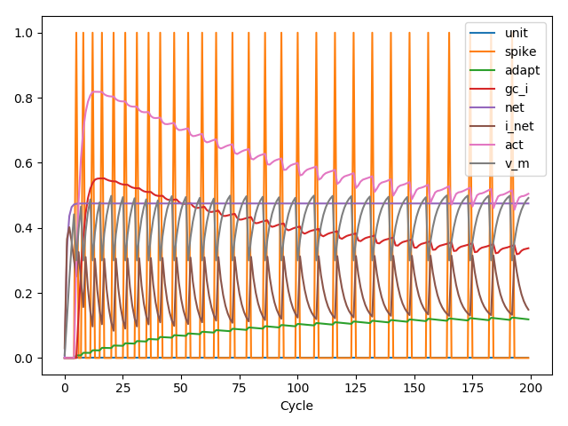
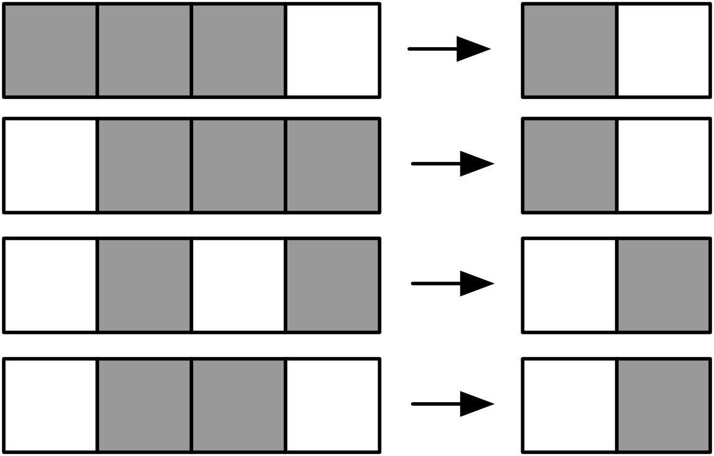

Tutorial
========

For an explanation of the algorithm and motivation behind **leabra7**,
see Prof. Randy O'Reilly's book `Computational Cognitive Neuroscience
<https://grey.colorado.edu/CompCogNeuro/index.php/CCNBook/Main>`_. This
tutorial assumes general familiarity with the concepts in that book,
and focuses on the mechanics of using the **leabra7** package.

**Contents:**

.. contents:: :local:

Two neurons
-----------

The simplest **leabra7** network consists of two neurons, with one
neuron driving the other. First, import the necessary libraries:

.. code-block:: python

		import matplotlib.pyplot as plt
		import pandas as pd
		import leabra7 as lb

		from typing import *

Now, we can create an empty network:

.. code-block:: python

		net = lb.Net()

We can now add two layers, each with one neuron:

.. code-block:: python

		layer_spec = lb.LayerSpec(
		    log_on_cycle=("unit_v_m",
		                  "unit_act",
				  "unit_i_net",
				  "unit_net",
                                  "unit_gc_i",
				  "unit_adapt",
				  "unit_spike"))
		net.new_layer(name="input", size=1, spec=layer_spec)
		net.new_layer(name="output", size=1, spec=layer_spec)

Each layer gets a spec ("specification") object which contains
simulation parameters. In this case, the :code:`log_on_cycle`
parameter tells the network to record each of the following attributes
every cycle:

- :code:`"unit_v_m`: The membrane potential of each neuron
- :code:`"unit_act"`: The activation of each neuron
- :code:`"unit_i_net"`: The net current into each neuron
- :code:`"unit_net"`: The net input into each neuron
- :code:`"unit_gc_i"`: The inhibitory current in each neuron
- :code:`"unit_adapt"`: The adaption current in each neuron
- :code:`"unit_spike"`: Whether the neuron is spiking

Spec objects can be used to specify many more parameters; see
:doc:`specs` for more information.

Connect the two layers with a projection:

.. code-block:: python

		net.new_projn(name="proj1", pre="input", post="output")

Before cycling the network, we will force the input layer to have an
activation of :code:`1`:

.. code-block:: python

		net.clamp_layer(name="input", acts=[1])

The :code:`acts` parameter is the sequence of activations that the
input layer will be clamped to. It does not have to specify a value
for every unit, since shorter patterns will be tiled.

Now, we can cycle the network:

.. code-block:: python

		for _ in range(200):
		    net.cycle()

Let's retrieve the network logs:

.. code-block:: python

   wholeLog, partLog = net.logs(freq="cycle", name="output")

The returned logs are simply Pandas dataframes.

Note that there are two kinds of logs: whole logs, and part
logs. Whole logs contain attributes that pertain to the whole object,
for example, the average activation of a layer. Part logs contain
attributes that pertain to the parts of an object. Since units are
parts of a layer, and we logged entirely unit attributes, we will work
with the parts logs:

We can plot the Pandas dataframe:

.. code-block:: python

		partLog = partLog.drop(columns=["unit"])
		ax = partLog.plot(x="time")
		ax.set_xlabel("Cycle")

Pattern association
-------------------

Now, we will try a slightly more complicated task: training a network
to recognize a simple set of patterns. First, as usual, we will import
the necessary libraries. We will also configure a project name and set
up Python's logging library to timestamp all of our logs (this is
useful for tracking the progress of training):

.. code-block:: python

		import logging
		import sys
		from typing import *
		import numpy as np
		import pandas as pd

		import leabra7 as lb

		PROJ_NAME = "pat_assoc"

		logging.basicConfig(
		    level=logging.DEBUG,
		    format="%(asctime)s %(levelname)s %(message)s",
		    handlers=(logging.FileHandler(
			"{0}_log.txt".format(PROJ_NAME), mode="w"),
			      logging.StreamHandler(sys.stdout)))

With this housekeeping out of the way, we can start to write the
actual network training code.We will break down the task of training a
network into a series of functions that can be modified for any
general network training task. First, define a function to load and
preprocess the input and output data:

.. code-block:: python

		def load_data() -> Tuple[np.ndarray, np.ndarray]:
		    """Loads and preprocesses the data.

		    Returns:
		      An (X, Y) tuple containing the features and labels,
		      respectively.

		    """
		    X = np.array([
			[1, 1, 1, 0],
			[0, 1, 1, 1],
			[0, 1, 0, 1],
			[0, 1, 0],
		    ])
		    Y = np.array([
			[1, 0],
			[1, 0],
			[0, 1],
			[0, 1]
		    ])
		    return (X, Y)

In this case, we are loading the following pattern associations:

We follow scikit-learn's convention of using the array
shape :code:`[n_samples, n_features]`.

Now, define a function to construct the network. We will use a simple
feedforward architecture with one input layer and one output layer.

.. code-block:: python

		def build_network() -> lb.Net:
		    """Builds the classifier network.

		    Returns:
		      A leabra7 network for classification.

		    """
		    logging.info("Building network")
		    net = lb.Net()

		    # Layers
		    layer_spec = lb.LayerSpec(
			gi=1.5,
			ff=1,
			fb=0.5,
			fb_dt=0.7,
			unit_spec=lb.UnitSpec(
			    adapt_dt=0,
			    vm_gain=0,
			    spike_gain=0,
			    ss_dt=1,
			    s_dt=0.2,
			    m_dt=0.15,
			    l_dn_dt=0.4,
			    l_up_inc=0.15,
			    vm_dt=0.3,
			    net_dt=0.7))
		    net.new_layer("input", size=4, spec=layer_spec)
		    net.new_layer("output", size=2, spec=layer_spec)

		    # Projections
		    spec = lb.ProjnSpec(
			lrate=0.02,
			dist=lb.Uniform(0.25, 0.75),
			thr_l_mix=0.01,
			cos_diff_lrate=False)
		    net.new_projn("input_to_output", pre="input", post="output", spec=spec)

		    return net

In this case, we have tweaked many of the parameters for improved
performance. This is not strictly necessary, since the default
parameters should work reasonably well.

Now, we will define a function to run a network *trial*, consisting of
a minus and a plus phase. In the minus phase, the input pattern will
be clamped to the network's input layer, and the network will be
cycled. In the plus phase, both the input and the output patterns will
be clamped to their respective layers, and the network will be again
cycled. The difference between these two phases (actual and
expectation) will drive learning.

.. code-block:: python

		def trial(network: lb.Net, input_pattern: Iterable[float],
			  output_pattern: Iterable[float]) -> None:
		    """Runs a trial.

		    Args:
		      input_pattern: The pattern to clamp to the network's input layer.
		      output_pattern: The pattern to clamp to the network's output layer.

		    """
		    network.clamp_layer("input", input_pattern)
		    network.minus_phase_cycle(num_cycles=50)
		    network.clamp_layer("output", output_pattern)
		    network.plus_phase_cycle(num_cycles=25)
		    network.unclamp_layer("input")
		    network.unclamp_layer("output")
		    network.learn()

The next function we will define will run an *epoch*, where one trial
is run for each pattern in the dataset:

.. code-block:: python

		def epoch(network: lb.Net, input_patterns: np.ndarray,
			  output_patterns: np.ndarray) -> None:
		    """Runs an epoch (one pass through the whole dataset).

		    Args:
		      input_patterns: A numpy array with shape (n_samples, n_features).
		      output_patterns: A numpy array with shape (n_samples, n_features).

		    """
		    for x, y in zip(input_patterns, output_patterns):
			trial(network, x, y)
		    network.end_epoch()

With these building blocks in place, we can write the main training function:

.. code-block:: python

		def train(network: lb.Net,
			  input_patterns: np.ndarray,
			  output_patterns: np.ndarray,
			  num_epochs: int = 3000) -> pd.DataFrame:
		    """Trains the network.

		    Args:
		      input_patterns: A numpy array with shape (n_samples, n_features).
		      output_patterns: A numpy array with shape (n_samples, n_features).
		      num_patterns: The number of epochs to run. Defaults to 500.

		    Returns:
		      pd.DataFrame:  A dataframe of metrics from the training run.

		    """
		    logging.info("Begin training")

		    data: Dict[str, List[float]] = {
			"epoch": [],
			"train_loss": [],
		    }

		    perfect_epochs = 0
		    for i in range(num_epochs):
			epoch(network, input_patterns, output_patterns)
			pred = predict(network, input_patterns)
			data["epoch"].append(i)
			data["train_loss"].append(mse_thresh(output_patterns, pred))

			logging.info("Epoch %d/%d. Train loss: %.4f", i, num_epochs,
			              data["train_loss"][-1])

			if data["train_loss"][-1] == 0:
			    perfect_epochs += 1
			else:
			    perfect_epochs = 0

			if perfect_epochs == 3:
			    logging.info("Ending training after %d perfect epochs.",
	                                  perfect_epochs)
			    break

		    return pd.DataFrame(data)

This training function continuously runs epochs until we get three
perfect epochs in a row, or we hit 3000 epochs. It also records the
training loss for each epoch, and returns the recorded metrics at the
end of training.

The training function makes use of two housekeeping functions which we will now define:

1. The thresholded mean-squared-error loss function, which measures the performance of the network.
2. The prediction function, which calculates predictions for an array of input patterns.

First, let's define the thresholded MSE loss function:

.. code-block:: python

		def mse_thresh(expected: np.ndarray, actual: np.ndarray) -> float:
		    """Calculates the thresholded mean squared error.

		    If the error is < 0.5, it is treated as 0 (i.e., we count < 0.5 as 0 and
		    > 0.5 as 1).

		    Args:
		      expected: The expected output patterns, with shape [n_samples, n_features].
		      actual: The actual output patterns, with shape [n_samples, n_features].

		    Returns:
		      The thresholded mean square error.

		    """
		    diff = np.abs(expected - actual)
		    diff[diff < 0.5] = 0
		    return np.mean(diff * diff)

And now, the prediction function:

.. code-block:: python

		def output(network: lb.Net, pattern: Iterable[float]) -> List[float]:
		    """Calculates a prediction for a single input pattern.

		    Args:
		      network: The trained network.
		      pattern: The input pattern.

		    Returns:
		      np.ndarray: The output of the network after clamping the input
		      pattern to the input layer and settling. The max value is set to one,
		      everything else is set to zero.

		    """
		    network.clamp_layer("input", pattern)
		    for _ in range(50):
			network.cycle()
		    network.unclamp_layer("input")
		    out = network.observe("output", "unit_act")["act"].values
		    return list(out)

		def predict(network: lb.Net, input_patterns: np.ndarray) -> np.ndarray:
		    """Calculates predictions for an array of input patterns.

		    Args:
			network: The trained network.
			input_patterns: An array of shape (n_samples, n_features)
			    containing the input patterns for which to calculate predictions.

		    Returns:
			np.ndarray: An array of shape (n_samples, n_features) containing the
			    predictions for the input patterns.

		    """
		    outputs = []
		    for item in input_patterns:
			outputs.append(output(network, item))
		    return np.array(outputs)

That was a lot of work, but we can now train the network with a few lines of code!

.. code-block:: python

		X, Y = load_data()
		net = build_network()
		metrics = train(net, X, Y)

		# Save metrics and network for future analysis
		metrics.to_csv("{0}_metrics.csv".format(PROJ_NAME), index=False)
		net.save("{0}_network.pkl".format(PROJ_NAME))

The script's output should look something like this:

.. code-block:: shell

		2018-09-06 22:07:50,202 INFO Begin training pat_assoc
		2018-09-06 22:07:50,202 INFO Building network
		2018-09-06 22:07:50,204 INFO Begin training
		2018-09-06 22:07:50,460 INFO Epoch 0/3000. Train loss: 0.6138
		2018-09-06 22:07:50,709 INFO Epoch 1/3000. Train loss: 0.5818
		2018-09-06 22:07:50,963 INFO Epoch 2/3000. Train loss: 0.5814
		2018-09-06 22:07:51,215 INFO Epoch 3/3000. Train loss: 0.5811

		...

		2018-09-06 22:09:27,980 INFO Epoch 392/3000. Train loss: 0.0319
		2018-09-06 22:09:28,227 INFO Epoch 393/3000. Train loss: 0.0315
		2018-09-06 22:09:28,476 INFO Epoch 394/3000. Train loss: 0.0000
		2018-09-06 22:09:28,722 INFO Epoch 395/3000. Train loss: 0.0000
		2018-09-06 22:09:28,970 INFO Epoch 396/3000. Train loss: 0.0000
		2018-09-06 22:09:28,971 INFO Ending training after 3 perfect epochs.

At which point the network will have learned to perfectly recognize
the desired patterns. That is to say, when we clamp the input pattern
to the input layer and cycle the network, the correct output pattern
will be reproduced on the out layer.

The file :code:`pat_assoc_metrics.csv` can be further analyzed as you
like, and the network can be easily loaded from the
:code:`pat_assoc_network.pkl` file in the future. See the
:doc:`network <net>` reference for more information.
